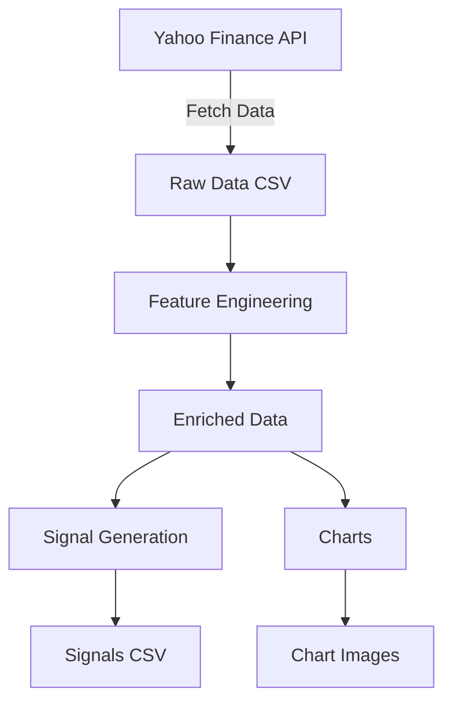

# Data Pipeline

The data pipeline is responsible for fetching, processing, and storing stock market data. This document outlines the architecture and components of the pipeline.

## Pipeline Architecture



## Components

### 1. Data Collection
- **Source**: Yahoo Finance API
- **Frequency**: Intraday (configurable)
- **Data Points**: Open, High, Low, Close, Volume
- **Storage**: CSV files organized by ticker and date

### 2. Data Processing
- **Feature Engineering**: Adds technical indicators
- **Data Validation**: Ensures data quality
- **Normalization**: Standardizes data formats

### 3. Storage
- **Structure**:
  ```
  data/
  └── [TICKER]/
      └── [YYYYMM]/
          ├── data-YYYYMMDD.csv
          ├── signals-YYYYMMDD.csv
          └── charts/
              └── chart-YYYYMMDD_HHMMSS.png
  ```

## Configuration

Edit `config.py` to customize:
- `TICKERS`: List of stock symbols to track (e.g., `['AAPL', 'MSFT']`)
- `START_DATE`: Initial data collection date (format: 'YYYY-MM-DD')
- `END_DATE`: Final data collection date (format: 'YYYY-MM-DD')
- `DATA_DIR`: Root directory for data storage (default: 'data')
- `INTERVAL`: Data interval ('1m', '5m', '15m', '1h', '1d')

## Usage Examples

### 1. Fetching Latest Data

#### Fetch today's data for all configured tickers:
```bash
python -m fetch_daily_data
```

#### Fetch data for a specific date:
```bash
python -m fetch_daily_data --date 20250707
```

#### Fetch data for a specific ticker:
```bash
python -m fetch_daily_data --ticker AAPL
```

#### Specify both date and ticker:
```bash
python -m fetch_daily_data --date 20250707 --ticker AAPL
```

### 2. Historical Data Backfill

#### Backfill data for a date range:
```bash
python -m backfill_data --start 20250101 --end 20250131 --ticker AAPL
```

#### Backfill for multiple tickers:
```bash
python -m backfill_data --start 20250101 --end 20250131 --tickers AAPL,MSFT,GOOG
```

### 3. Real-time Data Updates

#### Run as a service (continuously updates data):
```bash
python -m scheduler --interval 5
```
Options for `--interval`:
- `1`: Every minute
- `5`: Every 5 minutes (default)
- `15`: Every 15 minutes
- `60`: Every hour

### 4. Data Export

#### Export data to a single CSV:
```bash
python -m export_data --start 20250101 --end 20250131 --ticker AAPL --output aapl_jan_2025.csv
```

#### Export with specific columns:
```bash
python -m export_data --ticker AAPL --columns date,open,high,low,close,volume --output aapl_data.csv
```

## Data Structure

Processed data is stored in the following structure:
```
data/
└── [TICKER]/
    └── [YYYYMM]/
        ├── data-YYYYMMDD.csv      # Raw price data
        ├── signals-YYYYMMDD.csv   # Generated trading signals
        └── charts/               # Generated chart images
            ├── 5m/               # 5-minute interval charts
            ├── 15m/              # 15-minute interval charts
            └── 1h/               # 1-hour interval charts
```

## Environment Variables

You can override configuration using environment variables:
```bash
export TICKERS="AAPL,MSFT,GOOG"
export INTERVAL="15m"
python -m fetch_daily_data
```

## Logging

Logs are stored in `logs/` directory with daily rotation. To change log level:
```bash
python -m fetch_daily_data --log-level DEBUG
```

## Error Handling

Common issues and solutions:
1. **No Data Available**: Check if the market was open on the requested date
2. **Rate Limits**: Add delays between requests when fetching multiple tickers
3. **Invalid Dates**: Ensure dates are in YYYYMMDD format
4. **Missing Dependencies**: Run `poetry install` to install all required packages

## Workflows

### Daily Update
1. Fetch new market data
2. Process through feature engineering
3. Generate signals
4. Update visualizations

### Backfill
To process historical data:
```bash
poetry run python backfill.py --start 20230101 --end 20231231
```

## Data Retention
- Raw data is kept for reference
- Processed data is stored in the same directory
- Charts are generated on-demand

## Monitoring
- Check log files for errors
- Monitor disk usage
- Validate data quality regularly

## Best Practices
1. **Backup**: Regularly back up the data directory
2. **Validation**: Implement data quality checks
3. **Documentation**: Keep data dictionaries up to date
4. **Versioning**: Consider data versioning for major changes

For more details on specific components, see the [API Reference](../api/).
